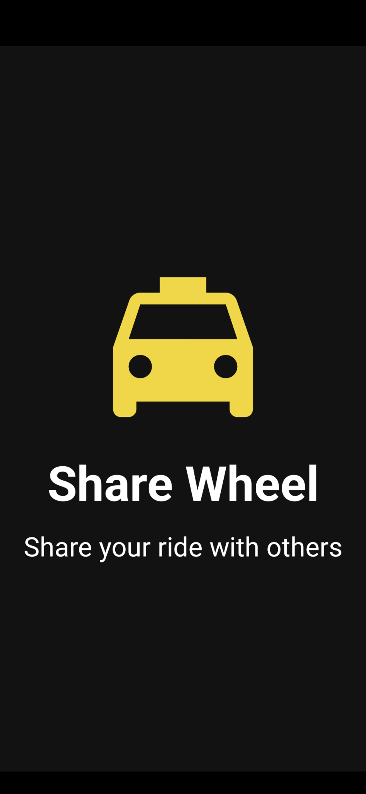
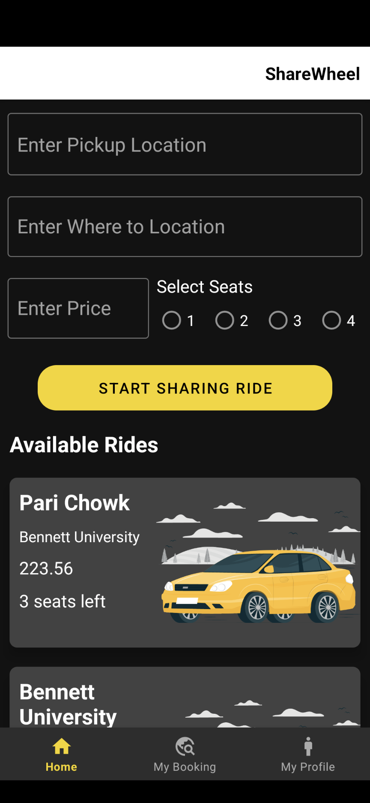
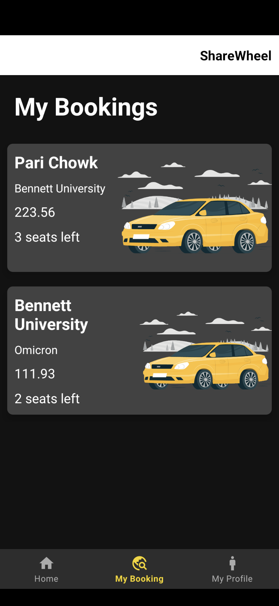
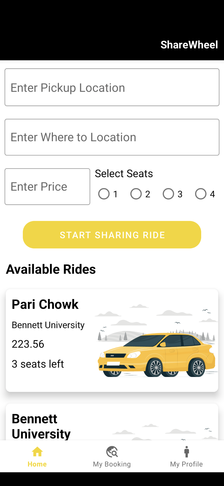

# Share Wheel

This is an Android app developed for the students of Bennett University to book sharing cabs and taxis. It is developed using Java and XML and is compatible with Android devices running version 10 and above.

## Screenshots

|  |  |  |  |
|:-----:|:-------------------------------------------------------:|:-------------------------------------------------------:|:-------------------------------------------------------:|

## Features

- User can register and login to the app using their email ID and password.
- User can look up available cabs and taxis.
- User can book a cab or taxi for sharing.

## Installation

- Clone the repository or download the ZIP file.
- Import the project into Android Studio.
- Connect your Android device to your computer.
- Build and run the app on your device.

Note: Make sure your Android device is running version 10 or above.

## Usage

- Launch the app on your device.
- Login using your email ID and password.
- Look at the available cabs and taxis.
- View the details of your booking.
- View your booking history.

## Technologies Used

- Java
- XML
- Android SDK
- Firebase

## Contributors

This project was developed by Chirag Aggarwal, Aman Boora, Satyam Raj and Akshay Negi as part of Team Obsidian for Bid N' Build Hackathon organized IEEE x WIE.